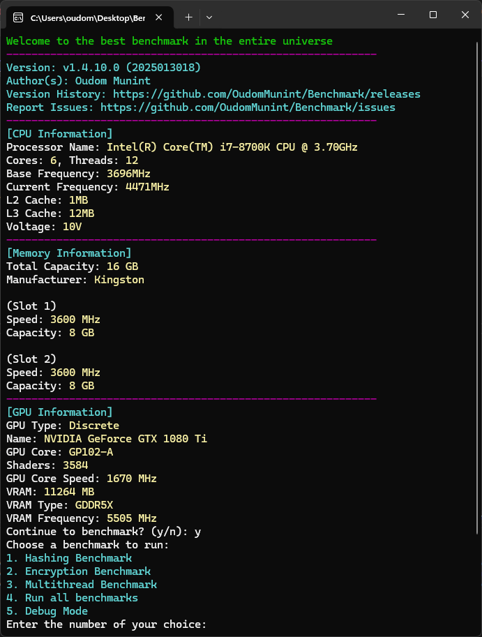
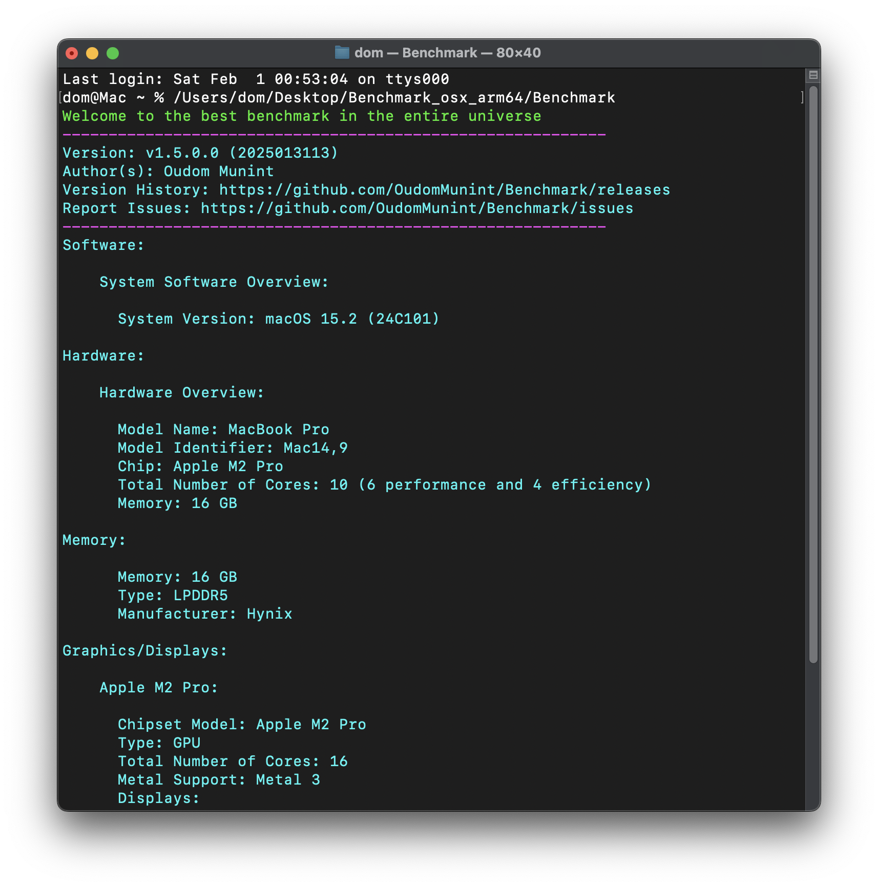
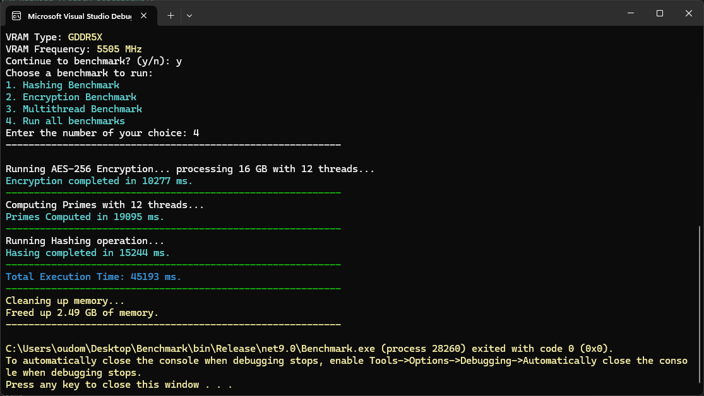
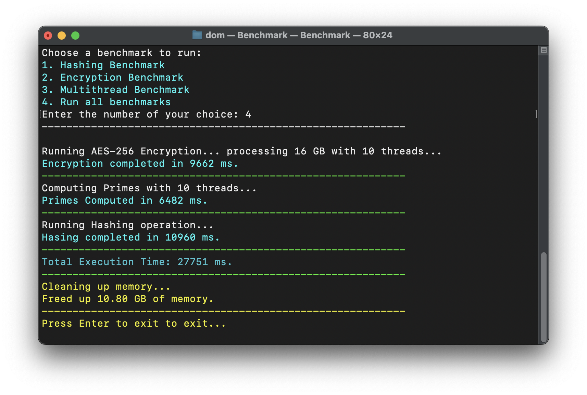

# Benchmark (.NET 9)

- An OS-agnostic C# console application that displays system specifications and lets you run various benchmarks.
- This program tests different aspects of your system, including CPU, memory, and I/O performance.
- It retrieves detailed CPU, RAM, and GPU specifications and offers the following benchmarks:
- A Hashing benchmark with MD5, SHA256 and SHA512.
- An intensive CPU benchmark that computes prime numbers
- An intensive CPU workload that involves Matrix multiplication.
- A large dataset encryption/decryption benchmark (May need admin privileges).
- Using <a href="https://github.com/dotnet/BenchmarkDotNet"> `BenchmarkDotNet` </a>, `SharpDX`, `NvAPIWrapper` and `Hardware.info`

# Test suite
- 🔢 Integer Performance – Prime number computation.
- 🧮 Floating-Point Performance – Matrix multiplication.
- 🔐 Cryptographic Performance – AES encryption and hashing.
- 💾 Memory Performance – 16GB dataset encryption operation.
- ⚡ Multithreading & Parallelism – Parallelized workloads. 

# Maintenance


# CI/CD & CodeQL

[](https://github.com/OudomMunint/Benchmark/actions/workflows/main.yml) [](https://github.com/OudomMunint/Benchmark/actions/workflows/codeql.yml)

# Getting Started
- Install `.NET 9 SDK` from <a href="https://dotnet.microsoft.com/download/dotnet/9.0"> `here` </a>
- Install `.Net 9.0.0 Runtime` from <a href="https://dotnet.microsoft.com/download/dotnet/9.0"> `here` </a>
- Open the solution in your favourite IDE and set "Benchmark" as the startup project.
- Run the benchmark in `Release` mode.
- Check your if system specs is correct
- `Y` to continue
- Select which benchmarks to run
- For `VSCode` you will need to install the `C#` extention for vscode
- For `VSCode` you also need to create `launch.JSON` and `task.JSON` files if you want to run in different configurations.
- If not you can use the provided JSON files.
- When the benchmark is done press `Enter` to exit.
- To cancel an ongoing benchmark press `Ctrl + C`

# Running the EXE

- Open the solution with preferred IDE
- Set the startup project to `Benchmark`
- Build with `dotnet build -c Release`
- Publish with `dotnet publish -c Release`
- Run `Benchmark.exe` in the `C:\Users\<Path to project>\Benchmark\bin\Release\net9.0\publish\` folder.

# Download the EXE
- Download the latest release from <a href="https://github.com/OudomMunint/Benchmark/releases"> `here` </a>


> [!NOTE]  
> This project is not signed or notarized (Can't afford apple developer lol)
> On macOS you might need to allow the app to run in `System Preferences > Security & Privacy` then scroll down and click `Open Anyway`.
> On Windows you might need to allow the app to run in `Windows Security` then click `Run Anyway`.

# Required SDKs & Runtimes

- `.NET 9.0.x` from <a href="https://dotnet.microsoft.com/download/dotnet/9.0"> `here` </a>
- `.Net 9.0.0 Runtime` from <a href="https://dotnet.microsoft.com/download/dotnet/9.0"> `here` </a>

# Debugging
- Set a breakpoint anywhere.
- Run the program in `Debug` mode.
- Use option `6` to start debugging.
- Select the benchmark you want to debug.
- The program will pause at the breakpoint.

# Use older versions of .NET
- Install the required SDKs and Runtimes.
- Change the target framework in the `Benchmark.csproj` file.
- Change `net9.0` to `net7.0` or `net8.0`.
- Run the application.

> [!NOTE]  
> Results should not be compared between different versions of .NET.

# Application output

<table>
  <tr>
    <td> <h3>Windows 11</h3> </td>
    <td> <h3>MacOS Sequoia</h3>  </td>
  </tr>
  <tr>
    <td>  </td>
    <td>  </td>
  </tr>
</table>

- Scroll down to see results.
- Results are also exported to a `.txt` file located in the `bin\Release\net9.0\publish\` folder.
- If you are running the downloaded `.exe` file, the results will be in the same folder as the `.exe` file.
- There might be up to a 20 seconds delay on first use due to hardware detection by `Hardware.Info`.

# Output results

<table>
  <tr>
    <td> <h3>Windows 11</h3> </td>
    <td> <h3>MacOS Sequoia</h3>  </td>
  </tr>
  <tr>
    <td>  </td>
    <td>  </td>
  </tr>
</table>

- Each benchmark will display it's runtime in `ms`.
- After all benchmark(s) are done, there will be a global runtime in `ms`.

# Specs for tested systems.

## MacBookPro 16" 2021

```ini
Apple M1 Max 10/32, 10 Cores 10 Threads (8P/2E)
32GB LPDDR5 6400MHz
macOS 13.6
```

## MacBookPro 14" 2023

```ini
Apple M2 Pro 10/16, 10 Cores 10 Threads (6P/4E)
16GB LPDDR5 6400MHz
macOS 13.6
```

## MacBookPro 13" 2017

```ini
Intel Core i5-7660U CPU 2.20GHz (Kaby Lake), 2 Cores 4 Threads (2P/0E)
8GB DDR3 2133MHz
macOS 12
```

## MacBookPro 15" 2018

```ini
Intel Core i7-8850H CPU 2.60GHz (Coffee Lake), 6 Cores 12 Threads (6P/0E)
16GB DDR4 2400MHz
Windows 10 bootcamp
```

## MacBookPro 15" 2018

```ini
Intel Core i7-8850H CPU 2.60GHz (Coffee Lake), 6 Cores 12 Threads (6P/0E)
16GB DDR4 2400MHz
macOS 13
```

## Desktop PC

```ini
Intel Core i7-8700K CPU 3.70GHz (Coffee Lake), 6 Cores 12 Threads (6P/0E)
16GB DDR4 3600MHz
Windows 11
```

## Workstation

```ini
Ryzen Thread Ripper 1950X CPU 3.9GHz (Zen 1), 16 Cores 32 Threads (16P/0E)
32GB DDR4 3400MHz
Windows 10
```

## Dell latitude 5531

```ini
Intel Core i7-12800H CPU 1.80GHz (Alder Lake), 14 Cores 20 Threads (6P/8E)
```

# Benchmark results
> [!NOTE]  
> Results are now tracked under issue #77
https://github.com/OudomMunint/Benchmark/issues/77

## .NET 7 Ranking (Legacy benchmarks):

1. Dell latitude 5531 - i7-12800H @ 55W `46s`
2. Desktop ThreadRipper - Ryzen Thread Ripper 1950X @ 3.9GHz `49s`
3. MacBook Pro 14" 2023 - M2 Pro 10 Core CPU (6P + 4E) `92s`
4. MacBook Pro 16" 2021 - M1 Max 10 Core CPU (8P + 2E) `98s`
5. Desktop i7 - i7-8700K @ 4.7ghz `151s`
6. MacBook Pro 15" 2018 - i7-8850H @ 45W `191s`
7. MacBook Pro 13" 2017 - i5-7660U @ 15W `573s`

## .NET 8 Ranking (Legacy benchmarks):

1. Dell latitude 5531 - i7-12800H @ 55W `32s`
2. MacBook Pro 14" 2023 - M2 Pro 10 Core CPU (6P + 4E) `35s`
3. Desktop ThreadRipper - Ryzen Thread Ripper 1950X @ 3.9GHz `38s`
4. MacBook Pro 16" 2021 - M1 Max 10 Core CPU (8P + 2E) `42s`
5. Desktop i7 - i7-8700K @ 4.7ghz `105s`
6. MacBook Pro 15" 2018 - i7-8850H @ 45W `133s`
7. MacBook Pro 13" 2017 - i5-7660U @ 15W `401s`

# Minimum system requirements

- .NET 9.0.x
- Dual core CPU
- Windows 10 or MacOS 12
- 4GB RAM
- 1GB Storage