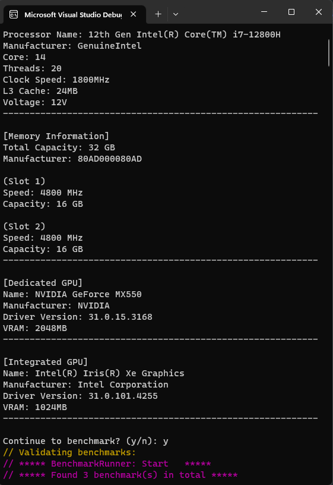
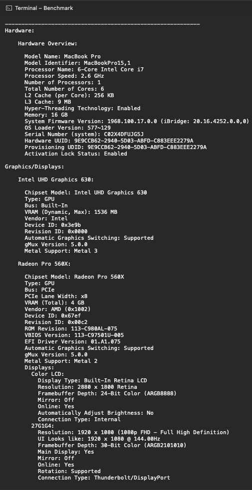

# Benchmark

[](https://github.com/OudomMunint/Benchmark/actions/workflows/main.yml) [](https://github.com/OudomMunint/Benchmark/actions/workflows/codeql.yml) 

- A C# console program that gathers your system details then runs a hash benchmark on MD5, SHA256, SHA512
- Used <a href="https://github.com/dotnet/BenchmarkDotNet"> `BenchmarkDotNet` </a>

# Getting Started
- Run the benchmark in `Release` mode.
- Check your if system specs is correct
- `Y` to continue

# Output 
<table>
  <tr>
    <td> <h3>Windows 11</h3> </td>
    <td> <h3>MacOS Ventura</h3>  </td>
  </tr>
  <tr>
    <td>  </td>
    <td>  </td>
  </tr>
</table>


- Scroll down to see results.
- `Runtime` in `seconds(s)` should be the benchmark.

# Compare your results to mine!
## MacBookPro 15" 2018
``` ini
Intel Core i7-8850H CPU 2.60GHz (Coffee Lake), 1 CPU, 12 logical and 6 physical cores (6P/0E)
```
- Runtime: `216s`

| Method |     Mean |   Error |  StdDev |
|------- |---------:|--------:|--------:|
| Sha256 | 407.1 μs | 3.20 μs | 3.00 μs |
| Sha512 | 232.6 μs | 4.48 μs | 4.19 μs |
|    Md5 | 174.0 μs | 2.08 μs | 1.94 μs |

## MacBookPro 15" 2018 `MacOS 13`
``` ini
Intel Core i7-8850H CPU 2.60GHz (Coffee Lake), 1 CPU, 12 logical and 6 physical cores (6P/0E)
```
- Runtime: `191s`

| Method |     Mean |   Error |   StdDev |
|------- |---------:|--------:|---------:|
| Sha256 | 240.3 us | 4.79 us | 13.97 us |
| Sha512 | 150.2 us | 0.63 us |  0.59 us |
|    Md5 | 161.7 us | 1.21 us |  1.07 us |

## Desktop
``` ini
Intel Core i7-8700K CPU 3.70GHz (Coffee Lake), 1 CPU, 12 logical and 6 physical cores (6P/0E)
```
- Runtime: `151s`

| Method |     Mean |   Error |  StdDev |
|------- |---------:|--------:|--------:|
| Sha256 | 301.1 μs | 3.50 μs | 3.11 μs |
| Sha512 | 272.1 μs | 4.54 μs | 7.51 μs |
|    Md5 | 199.8 μs | 3.18 μs | 1.28 μs |

## Dell latitude 5531
``` ini
Intel Core i7-12800H CPU 1.80GHz (Alder Lake), 1 CPU, 20 logical and 14 physical cores (6P/8E)
```
- Runtime: `46s`

| Method |     Mean |   Error |  StdDev |
|------- |---------:|--------:|--------:|
| Sha256 | 192.9 ns | 3.86 ns | 5.28 ns |
| Sha512 | 449.0 ns | 8.52 ns | 7.97 ns |
|    Md5 | 271.1 ns | 5.49 ns | 7.14 ns |
