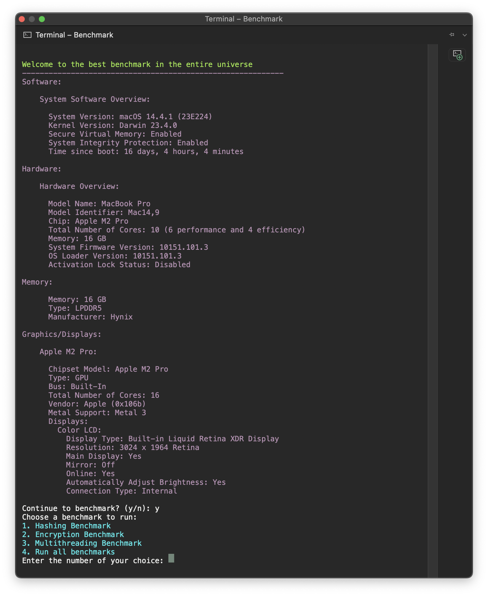

# Benchmark (.NET 8)

- A C# console program that gathers your system details then lets you run benchmarks on your system.
- You can run a Hashing benchmark with MD5, SHA256 and SHA512.
- Or a single thread and multi thread benchmark.
- Or a encrypt/decrypt benchmark (May need admin privileges)
- Using <a href="https://github.com/dotnet/BenchmarkDotNet"> `BenchmarkDotNet` </a>, `SharpDX`, `NvAPIWrapper` and `Hardware.info`

# Maintenance


# CI/CD & CodeQL

[](https://github.com/OudomMunint/Benchmark/actions/workflows/main.yml) [](https://github.com/OudomMunint/Benchmark/actions/workflows/codeql.yml)

# Getting Started
- Install `.NET 8 SDK` from <a href="https://dotnet.microsoft.com/download/dotnet/8.0"> `here` </a>
- Open the solution and set as startup project
- Run the benchmark in `Release` mode.
- Check your if system specs is correct
- `Y` to continue
- Use `1`, `2` or `3` to select which benchmarks to run
- Use `4` to run all benchmarks
- For `VSCode` you will need to install the `C#` extention for vscode
- For `VSCode` you also need to create `launch.JSON` and `task.JSON` files if you want to run in different configurations.
- If not you can use the provided JSON files.

# Running on OSX
- Install `.NET 8 SDK` for macOS from <a href="https://dotnet.microsoft.com/download/dotnet/8.0"> `here` </a>
- Open the solution and set as startup project.
- Run the benchmark in `Release` mode.
- If the app is terminated, open Benchmark.sln or csproj in terminal.
- Or `cd` into the `Benchmark` folder and run `dotnet run -c Release`

# Running the EXE

- Open the solution with preferred IDE
- Set the startup project to `Benchmark`
- Build with `dotnet build -c Release`
- Publish with `dotnet publish -c Release`
- Run `Benchmark.exe` in the `C:\Users\<Path to project>\Benchmark\bin\Release\net8.0\publish\` folder.

# Required SDKs

- .NET 8.0.2 from <a href="https://dotnet.microsoft.com/download/dotnet/8.0"> `here` </a>

# Output

<table>
  <tr>
    <td> <h3>Windows 11</h3> </td>
    <td> <h3>MacOS Ventura</h3>  </td>
  </tr>
  <tr>
    <td>  </td>
    <td>  </td>
  </tr>
</table>

- Scroll down to see results.
- `Runtime` in `seconds(s)` should be the benchmark.
- `Global Runtime` in `seconds(s)` can also be the benchmark.
- There might be a 20 seconds delay on first use due to hardware detection by `Hardware.Info`.

# Compare your results to mine!

## MacBookPro 16" 2021 `macOS 13.6`

```ini
Apple M1 Max 10/32, 1 CPU, 10 logical and 10 physical cores (8P/2E)
```

- .NET 7 Runtime: `98s`
- .NET 8 Runtime: `42s`

## MacBookPro 14" 2023 `macOS 13.6`

```ini
Apple M2 Pro 10/16, 1 CPU, 10 logical and 10 physical cores (6P/4E)
```

- .NET 7 Runtime: `92s`
- .NET 8 Runtime: `35s`

## MacBookPro 13" 2017 `MacOS 13`

```ini
Intel Core i5-7660U CPU 2.20GHz (Kaby Lake), 1 CPU, 4 logical and 2 physical cores (2P/0E)
```

-  .Net 7 Runtime: `573s`
-  .Net 8 Runtime: `401s`

## MacBookPro 15" 2018 `Windows 10 bootcamp`

```ini
Intel Core i7-8850H CPU 2.60GHz (Coffee Lake), 1 CPU, 12 logical and 6 physical cores (6P/0E)
```

- .NET 7 Runtime: `216s`
- .NET 8 Runtime: `191s`

## MacBookPro 15" 2018 `MacOS 13`

```ini
Intel Core i7-8850H CPU 2.60GHz (Coffee Lake), 1 CPU, 12 logical and 6 physical cores (6P/0E)
```

- .NET 7 Runtime: `216s`
- .NET 8 Runtime: `133s`

## Desktop i7

```ini
Intel Core i7-8700K CPU 3.70GHz (Coffee Lake), 1 CPU, 12 logical and 6 physical cores (6P/0E)
```

- .NET 8 Runtime: `105s`
- .NET 7 Runtime: `151s`

## Desktop ThreadRipper

```ini
Ryzen Thread Ripper 1950X CPU 3.9GHz (Zen 1), 1 CPU, 32 logical and 16 physical cores (16P/0E)
```

- Runtime: `49s`

## Dell latitude 5531

```ini
Intel Core i7-12800H CPU 1.80GHz (Alder Lake), 1 CPU, 20 logical and 14 physical cores (6P/8E)
```

- .NET7 Runtime: `46s`
- .NET8 Runtime: `32s`

## .NET 7 Ranking:

1. Dell latitude 5531 - i7-12700H @ 55W `46s`
2. Desktop ThreadRipper - Ryzen Thread Ripper 1950X @ 3.9GHz `49s`
3. MacBook Pro 14" 2023 - M2 Pro 10 Core CPU (6P + 4E) `92s`
4. MacBook Pro 16" 2021 - M1 Max 10 Core CPU (8P + 2E) `98s`
5. Desktop i7 - i7-8700K @ 4.7ghz `151s`
6. MacBook Pro 15" 2018 - i7-8850H @ 45W `191s`
7. MacBook Pro 13" 2017 - i5-7660U @ 15W `573s`

## .NET 8 Ranking:

1. Dell latitude 5531 - i7-12700H @ 55W `32s`
2. MacBook Pro 14" 2023 - M2 Pro 10 Core CPU (6P + 4E) `35s`
3. Desktop ThreadRipper - Ryzen Thread Ripper 1950X @ 3.9GHz `38s`
4. MacBook Pro 16" 2021 - M1 Max 10 Core CPU (8P + 2E) `42s`
5. Desktop i7 - i7-8700K @ 4.7ghz `105s`
6. MacBook Pro 15" 2018 - i7-8850H @ 45W `133s`
7. MacBook Pro 13" 2017 - i5-7660U @ 15W `401s`

# Minimum system requirements

- .NET 8.0.2
- Dual core CPU
- Windows 10 or MacOS 12
- 4GB RAM
- 1GB Storage